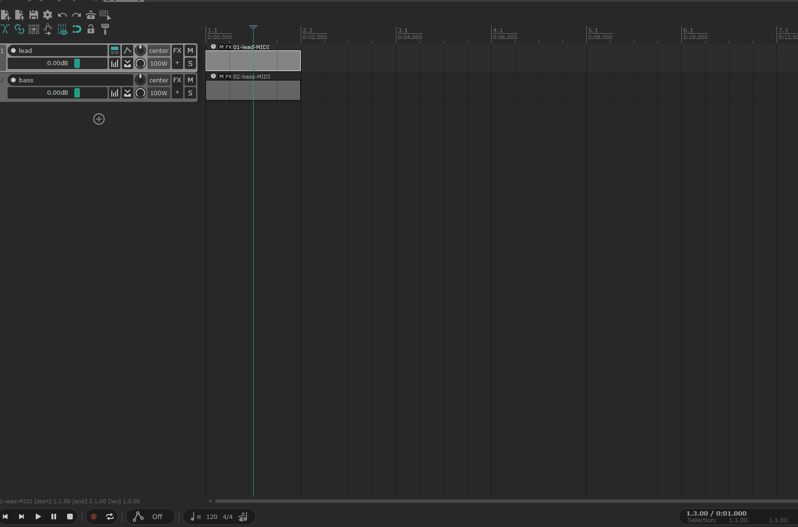

# Fluent MIDI Editor

**Finally, a MIDI editor for REAPER that feels good.**

A dockable piano roll for REAPER, inspired by Ableton's. Select MIDI clips on
several tracks and edit them together on one timeline: bass against kick,
call against response. No setup, no custom actions to wire up first.



> **Beta.** It is tested on one setup and has automated tests, but it has not met
> your projects yet. Please [report what breaks](https://github.com/onliner10/fluent-midi-editor/issues),
> or come say hi on [Discord](https://discord.gg/F6TJ6SDHcV).

## What it does

- **Several tracks at once.** Clips from different tracks share one grid, each in its own color. One gesture across tracks is one Undo step.
- **Phrases and repeats.** Set a phrase length in bars (`2`, `0.5`, `1.5`), halve or double it, and let a short phrase repeat to the end of the longest one. Repeats are real, pooled REAPER clips that keep playing after the editor is closed.
- **Modulation inside the clip.** Draw CC curves or steps, or move a knob in a plugin on the track to capture that parameter. The curve lives in the clip, so copying the clip carries it.
- **MPE expression per note.** As in Ableton's Note Expression view: bend a note's pitch on the note itself, draw slide and pressure in the lane below, or convert a plain part to MPE.
- **Fast editing.** Ctrl+D duplicates the selected time including silence, Alt+drag sets velocity, F folds to used pitches, Ctrl+wheel zooms around the pointer.
- **Native Undo, native MIDI.** Everything is written straight into REAPER's takes. Nothing needs to keep running.

Deliberately not included: quantize, legato, scales, and phrase generators.
It aims to make everyday editing pleasant, not to replace every tool REAPER has.

## Install

**[Step-by-step install guide](docs/install.md)**, with what you should see at each step and fixes for the usual problems.

The short version, in REAPER 7 or newer:

1. Install [ReaPack](https://reapack.com) if you do not have it (**Extensions → ReaPack** should exist).
2. **Extensions → ReaPack → Import repositories…**, paste
   ```
   https://github.com/onliner10/fluent-midi-editor/raw/main/index.xml
   ```
3. **Extensions → ReaPack → Browse packages…** and install **two** packages: **Fluent MIDI Editor**, and
   **ReaImGui: ReaScript binding for Dear ImGui** (by cfillion). Click **Apply**.
4. **Restart REAPER.** ReaImGui is loaded only at startup, and the editor cannot open without it.
5. Optional: **SWS** lets you preview notes through the track's instrument.

Requires REAPER 7 and ReaImGui 0.10 or later. Windows, macOS and Linux should work;
so far it has been tested on Windows.

## Use

Select MIDI clips, then run **Fluent MIDI Editor - Open** from the Actions list
(give it a shortcut). Your native MIDI editor and double-click stay as they are.
If you want double-click to open this editor instead, run
**Fluent MIDI Editor - Set as default editor**; **Restore default editor** undoes it.

The full [user guide](docs/guide.md) covers every gesture and shortcut.

## Community

Bug reports, ideas and early dev builds live on the [Discord](https://discord.gg/F6TJ6SDHcV).
Bugs can also go to [GitHub issues](https://github.com/onliner10/fluent-midi-editor/issues).
To try dev builds, enable pre-releases for Fluent MIDI Editor in ReaPack.
The editor links to both from **Options**.

## Development

```
python -m pip install -r requirements-dev.txt
python -m unittest discover -s tests
```

## License

[MIT](LICENSE). Not affiliated with Ableton or Cockos.
